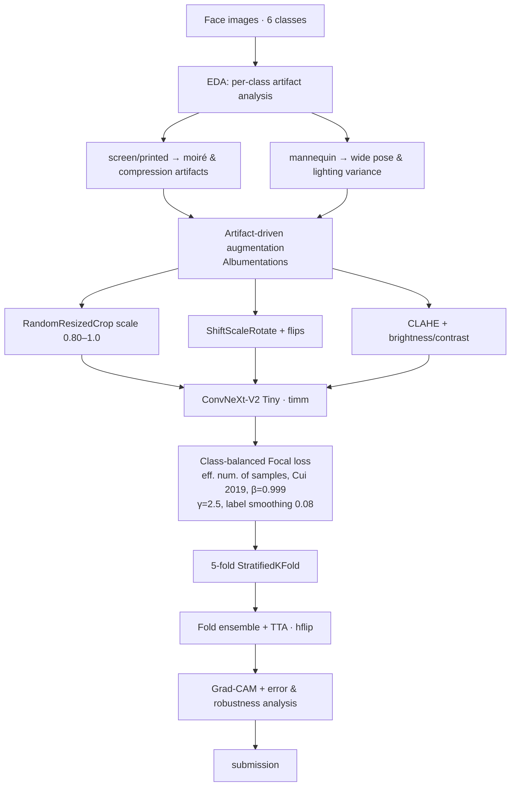

# FindIT 2026 — Face Anti-Spoofing 🎯 Top-15 Finalist / 339 Teams

> Six-class **face presentation-attack detection** (real vs. five spoof types) for the DAC FindIT 2026
> Computer-Vision track. Selected as **one of 15 finalist teams out of 339**, then presented a report and
> a live pitch.

**Competition:** DAC — FindIT 2026 (Computer Vision track)
**Result:** 🏅 **Top-15 finalist / 339 teams** — validation **macro-F1 0.9634 / accuracy 0.9636**
**Type:** Image classification — biometric anti-spoofing (1,652 train / 404 test images)

---

## Problem

Classify a face image into one of **six classes** — `realperson`, `fake_mask`, `fake_printed`,
`fake_screen`, `fake_mannequin`, `fake_unknown` — to detect presentation attacks. Two things made this
hard:

1. **Domain shift / robustness** — lighting, camera, and framing differ between the train and test faces,
   so a model that memorizes training conditions fails on the leaderboard.
2. **Small, imbalanced data** — only a few hundred images with uneven class counts, so regularization and
   class-balancing matter more than raw model size.

The winning lever was an **augmentation pipeline engineered directly from the failure modes** rather than
a bigger network.

---

## Approach



### Key decisions
- **CLIP-based label cleaning** — a confident-learning stage (Cleanlab + CLIP ViT-B/16 features combined into a composite anomaly score) flagged **717 of 1,652** images as potentially mislabeled before training.
- **Augmentation from evidence, not habit.** EDA showed `fake_screen`/`fake_printed` carry visible moiré
  and compression artifacts while `fake_mannequin` has wide pose/lighting variance — motivating
  `RandomResizedCrop(scale=0.80–1.0)` and `ShiftScaleRotate` over static resizing (which overfit to framing).
- **ConvNeXt-V2 Tiny** (via `timm`) — a strong modern backbone that fits a laptop RTX 4060.
- **Class-balanced Focal loss** — effective-number-of-samples weighting (Cui et al., 2019, β=0.999) plus
  focal γ=2.5 and label smoothing 0.08 to handle imbalance and hard examples.
- **5-fold StratifiedKFold ensemble + test-time augmentation** (horizontal flip) to stabilize a
  high-variance small-data score (a different split can move val-F1 by 1–2% at this sample size, so the
  seed is fixed for fair comparison).
- **Interpretability & robustness:** Grad-CAM to confirm the model attends to artifact regions, plus
  per-class error analysis.

---

## Tech stack

`Python` · `PyTorch` · `timm (ConvNeXt-V2 + GeM)` · `CLIP (ViT-B/16)` · `Cleanlab` · `Albumentations` · `scikit-learn` · `Grad-CAM` · NVIDIA RTX 4060 (laptop)

---

## Repository structure

```
findit-2026-antispoofing/
├── notebook/
│   └── findit_antispoofing.ipynb   # EDA → augmentation → training → K-fold ensemble → TTA → Grad-CAM
├── README.md
└── .gitignore                      # excludes competition images + trained weights
```

## How to run

> ⚠️ The DAC FindIT 2026 image dataset and the trained fold weights (`best_fold{0..4}.pth`, ~108 MB each)
> are **not included** — competition rules prohibit redistribution. Point the notebook's data path at the
> competition images to reproduce. A CUDA GPU is recommended.

```bash
pip install torch torchvision timm albumentations opencv-python scikit-learn matplotlib
jupyter notebook notebook/findit_antispoofing.ipynb
```

## Documentation

Cover previews of the finalist **slide deck** and **written report** are in [`docs/`](./docs)
(`slides-cover.png`, `report-cover.png`). The poster is not included.

## Screenshots

<!-- TODO: add screenshots -->
- `TODO:` finalist announcement (Top-15 / 339)
- `TODO:` Grad-CAM montage (model attending to spoof artifacts)
- `TODO:` confusion matrix / per-class F1
- `TODO:` exact validation macro-F1 / accuracy from the final run

---

## Collaborators

Team competition — built together with:

- **Nicho Darren** — GitHub [@nichodarren](https://github.com/nichodarren) · [LinkedIn](https://linkedin.com/in/nichodarren/)
- **Ivan William** — GitHub [@IvanWiliam13](https://github.com/IvanWiliam13) · [LinkedIn](https://linkedin.com/in/ivanwilliaml/)

Work was fully collaborative; I also delivered the finalist report and pitch.
